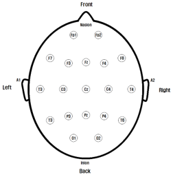
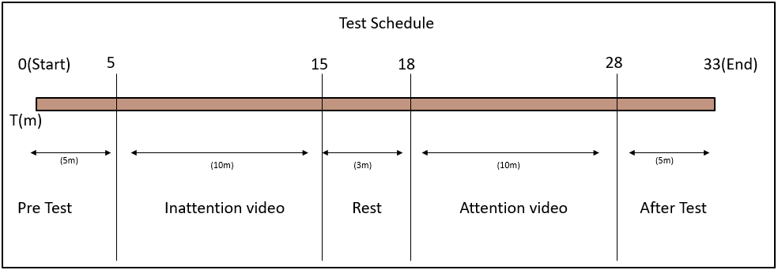
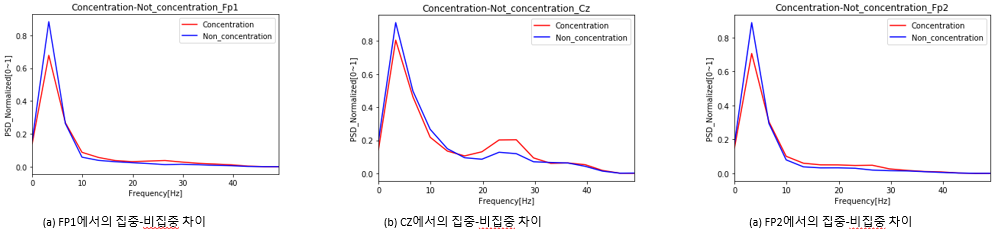

# Capstone
Youtube link : https://www.youtube.com/watch?v=wY4boisWBzA&t=59s

# 운전 시뮬레이터

# 집중력 실험

<h3>10-20 System</h3>

 - FP1, FP2, CZ 3곳에 전극을 부착하여 EEG 신호를 확인한다  

<h3><b>실험자 주의사항</b></h3>

 - 6시간 이상의 숙면을 취한 채로 실험에 임한다.
 - 실험 당일 카페인 음료를 섭취하지 않은 채로 실험에 임한다.
 - 동영상 시청 중에는 최대한 움직이지 않는 상태로 동영상을 시청한다.

<h3><b>실험 절차</b></h3>

 - [00:00 - 00:05] 사전 지식 확인을 위한 Pre Test(2문제)
 - [00:05 - 00:15] 집중을 하지 않은 채로 동영상 시청
 - [00:15 - 00:18] 휴식
 - [00:18 - 00:28] 집중을 유지한 채로 동영상 시청
 - [00:28 - 00:33] 집중도 확인을 위한 After Test(2문제)

# 결과

FP1, FP2, CZ 모두 집중한 경우(빨간 선) Beta파가, 집중하지 않은 경우(파란 선) Theta 파가 더 높은 경향을 보였다.
